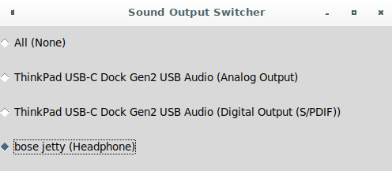

# soundswitcher
Simple UI utility to switch between different sound outputs(sinks) in Linux with PulseAudio.

It is created to avoid using pulseaudio control panel for choosing corrent sound output every time new device is added.

Just use arrows to select output and press `Enter` to switch to it or `Esc` to exit without changes.

## Installation

``
go build -o soundswitcher
sudo cp ./soundswitcher /usr/local/bin
``

After that you can bind it to some key combination in your window manager.

